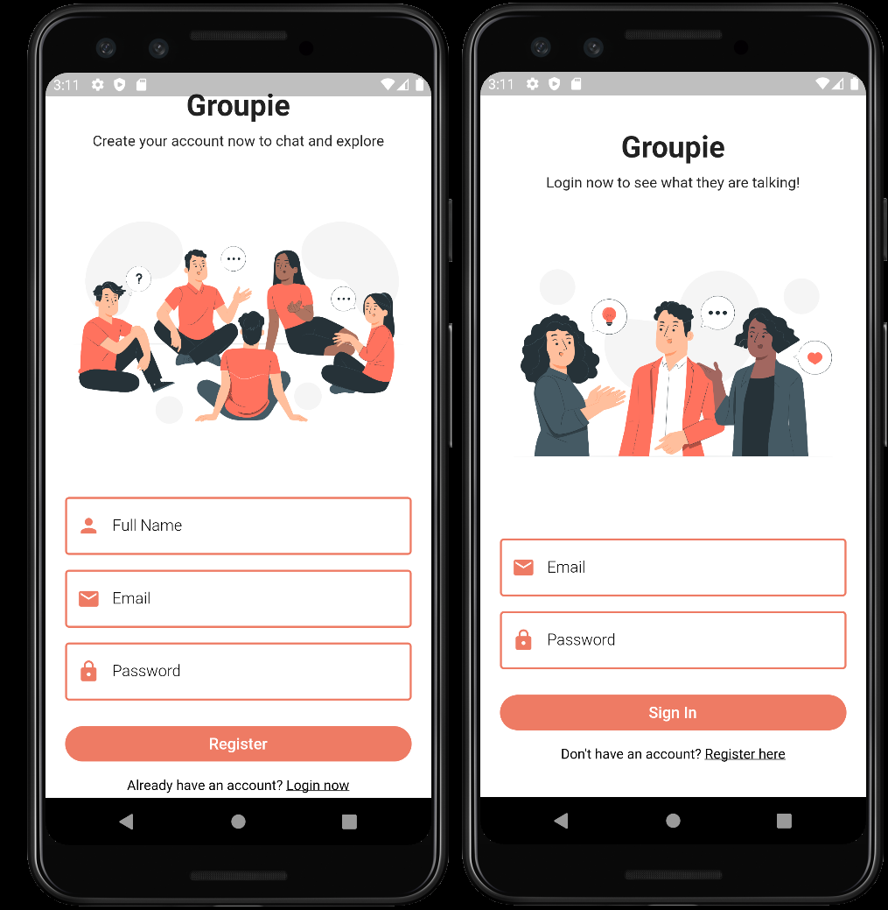
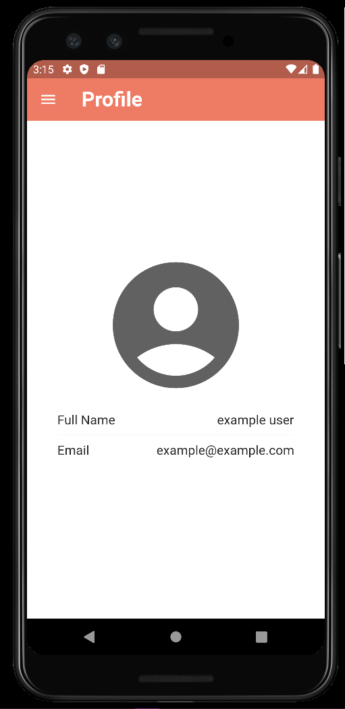
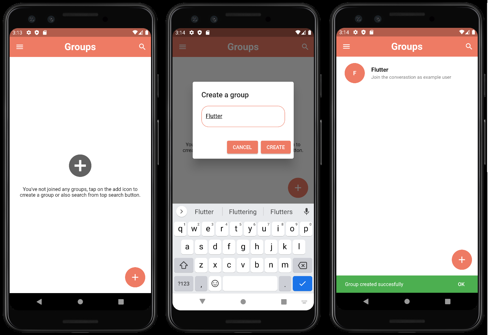
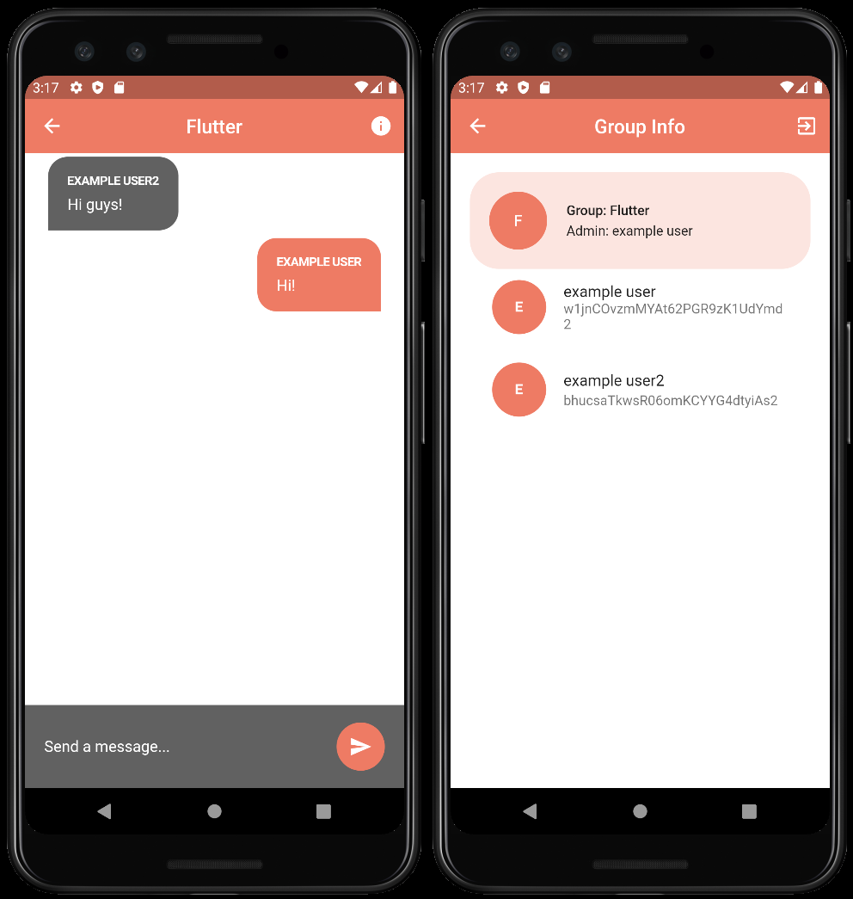
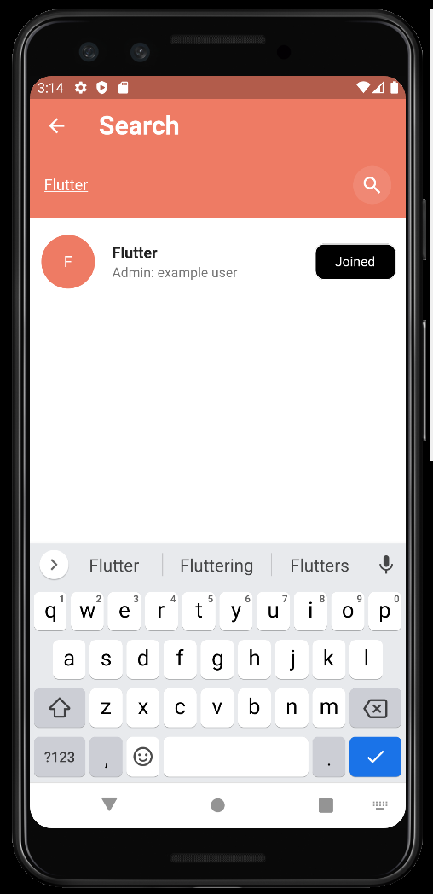
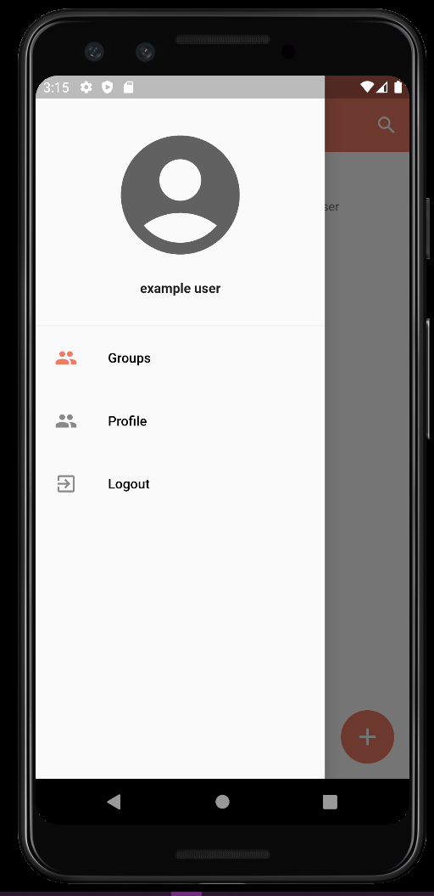
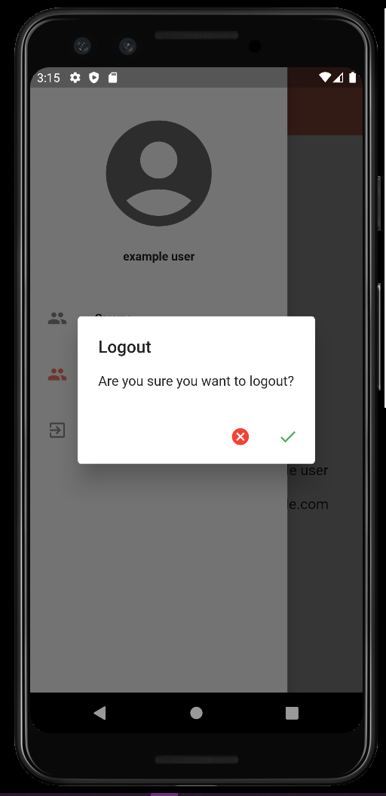

# Chat app 

## Cross Platform Message App (iOs, Android, Web). 
App where you are able to create a group, see group details, join others groups, create account, login to your account, seee your profile details, logout and the most important, chat with others.

Technologies used to develop app : 
- Flutter
- Firebase

## Login / Register Screen

## Profile Details

## Create a group

## Chat Screen and Group Details

## Searching groups

## App drawer

## Logout

